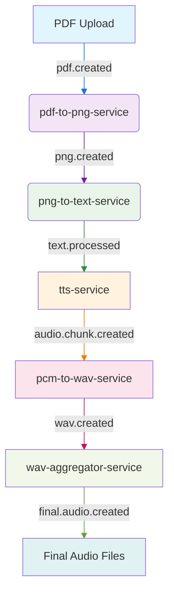

# NATS Architecture and Pipeline Documentation

## 1. System Architecture Overview

This project utilizes a resilient, event-driven microservices architecture built on NATS and JetStream. Services are decoupled and communicate asynchronously by passing messages, which contain references to data rather than the data itself. This allows for a scalable and robust document processing pipeline.

The high-level data flow is as follows:

```
[PDF Upload] -> (pdf.created) -> [pdf-to-png-service] -> (png.created) -> [png-to-text-service] -> (text.processed) -> [tts-service] -> (audio.chunk.created) -> [pcm-to-wav-service] -> (wav.created) -> [wav-aggregator-service] -> (final.audio.created) -> [Final Audio Files]
```

## 2. Core Concepts

### NATS & JetStream

NATS provides the core messaging backbone. We specifically use **JetStream**, the persistence layer of NATS, for all inter-service communication. This guarantees that even if a consuming service is offline, messages will be retained and processed once the service comes back online (at-least-once delivery).

### JetStream Object Store

To handle large binary files (PDFs, PNGs, audio), we use the **JetStream Object Store**. Instead of publishing large payloads directly into a NATS message, which is inefficient, we follow this pattern:

1.  A service uploads a large file (e.g., a PDF) to a designated Object Store bucket.
2.  The service then publishes a small, lightweight event message to a NATS subject.
3.  This event message contains a **key** (e.g., `pdf_key`) that uniquely identifies the file in the Object Store.
4.  The consuming service receives this event, extracts the key, and uses it to retrieve the file directly from the Object Store.

This pattern keeps the messaging layer fast and efficient while allowing for the transfer of arbitrarily large files.

## 3. Service Interaction Pipeline (End-to-End Flow)

### 3.1. `pdf-to-png-service`

-   **Input:** Consumes a `PDFCreatedEvent` from the subject defined in its consumer configuration.
-   **Action:**
    1.  Extracts the `PDFKey` from the event.
    2.  Downloads the source PDF from the configured object store.
    3.  Converts each page of the PDF into a separate PNG image.
    4.  Uploads each generated PNG to the configured object store.
-   **Output:** For each successfully created PNG, it publishes a `PNGCreatedEvent` to the configured subject.

### 3.2. `png-to-text-service`

-   **Input:** Consumes `PNGCreatedEvent` messages from the subject defined in its consumer configuration.
-   **Action:**
    1.  Extracts the `PNGKey` from the event.
    2.  Downloads the corresponding PNG image from the configured object store.
    3.  Performs Optical Character Recognition (OCR) on the image to extract text.
    4.  Optionally augments the text with AI-generated commentary.
    5.  Uploads the resulting text to the configured object store.
-   **Output:** Publishes a `TextProcessedEvent` to the configured subject.

### 3.3. `tts-service`

-   **Input:** Consumes `TextProcessedEvent` messages from the subject defined in its consumer configuration.
-   **Action:**
    1.  Extracts the `TextKey` from the event.
    2.  Downloads the text file from the configured object store.
    3.  Generates a raw PCM audio representation of the text.
    4.  Uploads the final audio segment to the configured object store.
-   **Output:** Publishes an `AudioChunkCreatedEvent` to the configured subject.

### 3.4. `pcm-to-wav-service`

-   **Input:** Consumes `AudioChunkCreatedEvent` messages from the subject defined in its consumer configuration.
-   **Action:**
    1.  Extracts the `AudioKey` from the event.
    2.  Downloads the PCM audio file from the configured object store.
    3.  Converts the PCM file to a WAV file.
    4.  Uploads the final WAV file to the configured object store.
-   **Output:** Publishes a `WavFileCreatedEvent` to the configured subject.

### 3.5. `wav-aggregator-service`

-   **Input:** Consumes `WavFileCreatedEvent` messages from the subject defined in its consumer configuration.
-   **Action:**
    1.  Persists workflow state in a NATS Key-Value store.
    2.  When all WAV files for a workflow are received, it downloads them from the configured object store.
    3.  Combines them into a single WAV file.
    4.  Uploads the final WAV file to the configured object store.
-   **Output:** Publishes a `FinalAudioCreatedEvent` to the configured subject.
## 4. Configuration & Event Reference

### 4.1. Event Payloads (`events` package)

All events share a common `EventHeader`. The key data fields for each event are:

-   `PDFCreatedEvent`: Contains `PDFKey` (string).
-   `PNGCreatedEvent`: Contains `PNGKey` (string), `PageNumber` (int), `TotalPages` (int).
-   `TextProcessedEvent`: Contains `TextKey` (string), `PNGKey` (string), `PageNumber` (int), `TotalPages` (int), and TTS parameters: `Voice` (string), `Seed` (int), `NGL` (int), `TopP` (float64), `RepetitionPenalty` (float64), `Temperature` (float64).
-   `AudioChunkCreatedEvent`: Contains `AudioKey` (string), `PageNumber` (int), `TotalPages` (int).
-   `WavFileCreatedEvent`: Contains `WavKey` (string), `PageNumber` (int), `TotalPages` (int).
-   `FinalAudioCreatedEvent`: Contains `FinalAudioKey` (string).

### 4.2. Configuration (`project.toml`)

The central `project.toml` file defines all NATS-related configuration. Each service has its own `[<service-name>.nats]` table that follows the unified configuration model.

```toml
[nats]
url = "nats://127.0.0.1:4222"

[pdf-to-png-service.nats]
streams = [
  { name = "pdfs", subjects = ["book-expert.pdfs.created"] },
  { name = "pngs", subjects = ["book-expert.pngs.created"] }
]
consumers = [
  { stream_name = "pdfs", consumer_name = "pdf-to-png-consumer", filter_subject = "book-expert.pdfs.created" }
]
object_stores = [
  { bucket_name = "pdf-files" },
  { bucket_name = "png-files" }
]

[png-to-text-service.nats]
streams = [
  { name = "texts", subjects = ["book-expert.texts.created"] }
]
consumers = [
  { stream_name = "pngs", consumer_name = "png-to-text-consumer", filter_subject = "book-expert.pngs.created" }
]
object_stores = [
  { bucket_name = "png-files" },
  { bucket_name = "text-files" }
]

# ... and so on for the other services
```

### 4.3. Unified Configuration Model (`configurator` package)

To ensure consistency and simplify NATS configuration, the project now uses a unified configuration model provided by the `configurator` package. This package defines a set of standardized structs that are used by all services to configure their NATS resources.

**Go Structs:**

```go
// package configurator

// ServiceNATSConfig is a container for all NATS-related configuration for a service.
type ServiceNATSConfig struct {
	NATS         NATSConfig          `toml:"nats"`
	Streams      []StreamConfig      `toml:"streams"`
	Consumers    []ConsumerConfig    `toml:"consumers"`
	ObjectStores []ObjectStoreConfig `toml:"object_stores"`
	KeyValue     *KeyValueConfig     `toml:"key_value"`
}

// NATSConfig represents the NATS configuration for a service.
type NATSConfig struct {
	URL string `toml:"url"`
}

// StreamConfig defines the configuration for a JetStream stream.
type StreamConfig struct {
	Name     string   `toml:"name"`
	Subjects []string `toml:"subjects"`
}

// ... and so on for ConsumerConfig, ObjectStoreConfig, and KeyValueConfig
```

**Usage:**

Each service loads its NATS configuration into the `configurator.ServiceNATSConfig` struct. The `configurator` package also provides a set of helper functions to simplify the setup of NATS components, such as creating streams, consumers, and object stores.

## 5. Communication Patterns

The services in this project employ two primary NATS communication patterns, each suited for different use cases.

### 5.1. Durable, Queue-Based Consumers (Workers)

This is the most common pattern, used for services that perform work that must be completed reliably, such as the `pdf-to-png-service`, `png-to-text-service`, and `wav-aggregator-service`.

-   **Streams and Consumers:** These services use JetStream **streams** to persist messages and **durable consumers** to read from them. A durable consumer remembers its position in the stream, so if the service restarts, it can resume processing where it left off.
-   **Queue Groups:** Consumers are configured as a **queue group**. This means that although there may be multiple instances of a service running (for scalability), only one instance in the group will receive and process a given message. This ensures that each job is processed exactly once by the group.
-   **Acknowledgements:** Services use manual message acknowledgement (`msg.Ack()`). A message is only acknowledged after it has been successfully processed. If processing fails, the message is not acknowledged, and NATS will redeliver it for another attempt, providing at-least-once delivery semantics.

### 5.2. Simple Publish/Subscribe

This pattern is used for services that simply publish event notifications without needing the guarantees of durable, queue-based consumption. The `tts-service` and `pcm-to-wav-service` are examples of this.

-   **Publishers:** The service publishes a message to a specific subject.
-   **Subscribers:** Any service interested in that event can subscribe to the subject. Unlike queue groups, if there are multiple subscribers to a subject, they will **all** receive the message.
-   **No Durability (by default):** In this simple pattern, if a subscriber is not running when the message is published, it will not receive it. This is suitable for "fire-and-forget" notifications where guaranteed delivery is not a strict requirement for the publisher.

## 6. NATS Flow Diagram

The following diagram illustrates the complete flow of events through the NATS system:

