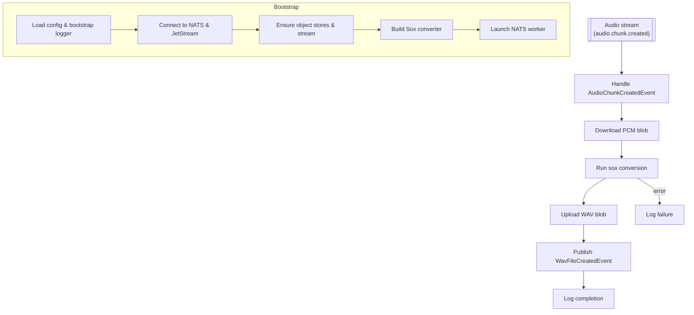

# PCM to WAV Service

## Project Summary

A NATS-based microservice that converts PCM audio samples into WAV files for downstream distribution.

## Detailed Description

The service subscribes to `AudioChunkCreatedEvent` messages on a JetStream subject. For every message it:

1. Downloads the referenced PCM blob from a JetStream object store.
2. Invokes the `sox` CLI with the configured encoding, bit depth, and sample rate to produce a WAV file.
3. Uploads the WAV artifact to a separate JetStream object store.
4. Publishes a `WavFileCreatedEvent` carrying the new object key for later aggregation.

If any stage fails, the worker logs the failure with workflow context; downstream systems detect the missing completion event and can retry or alert.

Core capabilities include:

-   **NATS Integration**: Coordinates messaging and blob storage through NATS JetStream.
-   **Deterministic Audio Conversion**: Uses `sox` with explicitly configured parameters to guarantee consistent WAV output.
-   **Operational Visibility**: Emits structured logs for successes and failures so the pipeline can react to gaps.

## Architecture



Key implementation touchpoints:

- `cmd/pcm-to-wav-service/main.go:22-206` bootstraps configuration, creates JetStream resources, and supervises the worker lifecycle.
- `internal/worker/worker.go:15-120` consumes `AudioChunkCreatedEvent`, orchestrates download/convert/upload, and publishes `WavFileCreatedEvent` notifications.
- `internal/converter/converter.go:22-111` validates Sox parameters and shells out to `sox` to produce WAV data.
- `internal/objectstore/objectstore.go:12-55` exposes wrapper methods over JetStream object stores for PCM downloads and WAV uploads.

## Technology Stack

-   **Programming Language:** Go 1.25
-   **Messaging & Storage:** NATS JetStream
-   **Audio Conversion:** `sox`
-   **Libraries:**
    -   `github.com/nats-io/nats.go`
    -   `github.com/book-expert/configurator`
    -   `github.com/book-expert/events`
    -   `github.com/book-expert/logger`
    -   `github.com/google/uuid`
    -   `github.com/stretchr/testify`

## Getting Started

### Prerequisites

-   Go 1.25 or later.
-   NATS server with JetStream enabled.
-   `sox` installed and available on the `PATH`.

### Installation

```bash
make build
```

The command outputs the `pcm-to-wav-service` binary in the `bin` directory.

### Configuration

Set the `PROJECT_TOML` environment variable to a reachable TOML document with the following structure:

```toml
[nats]
url = "nats://localhost:4222"
audio_chunk_created_subject = "audio.chunk.created"
wav_created_subject = "wav.created"
audio_object_store_bucket = "AUDIO_FILES"
wav_object_store_bucket = "WAV_FILES"

[pcm_to_wav_service.sox]
encoding = "signed-integer"
bits = 16
rate = 24000
channels = 1
input_type = "raw"
output_type = "wav"
```

## Usage

```bash
./bin/pcm-to-wav-service
```

A successful job will:

- download the PCM payload from `audio_object_store_bucket`
- convert it to WAV via `sox` using the configured parameters
- upload the WAV artifact to `wav_object_store_bucket`
- publish a `WavFileCreatedEvent` and log the workflow outcome

## Testing

```bash
make test
```

## License

Distributed under the MIT License. See the `LICENSE` file for more information.
