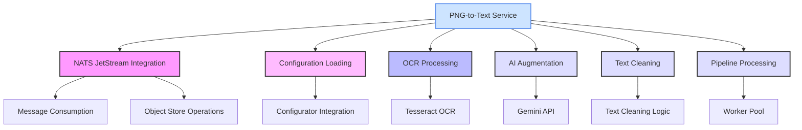

# PNG‑to‑Text Service

## Project Summary
Converts PNG images into cleaned, optionally AI‑augmented text and publishes results via NATS/JetStream.

## Detailed Description
This service consumes PNGCreatedEvent messages from NATS JetStream, downloads the referenced PNG from a JetStream Object Store, performs OCR using Tesseract, and optionally augments the text with Gemini (Google) based on per‑message or default configuration. The final text is uploaded to a text object bucket and a TextProcessedEvent is published for downstream services (e.g., TTS).

Core flow:
- Consume PNGCreatedEvent from a configured stream/consumer.
- Fetch PNG bytes from the configured object store bucket.
- OCR + clean text using Tesseract; optionally augment (commentary/summary) via Gemini.
- Store final text into the configured text object bucket.
- Publish TextProcessedEvent containing the text object key and TTS defaults.

## Technology Stack
- Programming Language: Go 1.25+
- Messaging & Storage: NATS JetStream (streams, durable consumers, object store)
- OCR: Tesseract (external binary)
- Optional AI: Gemini API
- Libraries: configurator, events, logger, prompt-builder, nats.go, testify

## Getting Started

### Prerequisites
- Go 1.25.1 (https://go.dev/dl/)
- Tesseract OCR
  - Ubuntu/Debian: `sudo apt-get update && sudo apt-get install -y tesseract-ocr`
  - macOS (Homebrew): `brew install tesseract`
- NATS Server (local dev)
  - Docker: `docker run -p 4222:4222 -p 8222:8222 nats:latest -js`
- golangci-lint (for lint): https://golangci-lint.run/usage/install/
- nats CLI (optional for testing): https://github.com/nats-io/natscli

### Installation
1) Clone and enter the repo
- `git clone https://github.com/book-expert/png-to-text-service`
- `cd png-to-text-service`
2) Modules and build
- `make install`
- `make build` (binary at `~/bin/png-to-text-service`)

### Configuration
Configuration is provided centrally via the configurator application. Do not craft ad‑hoc project files for this service. Instead:
- Set `PROJECT_TOML` to the canonical project configuration URL or path managed by configurator.
- The schema consumed by this service is defined by its config types and the configurator ServiceNATSConfig.
- Key references for fields expected by this service:
  - Service config container: `internal/config/config.go:68`
  - PNG‑to‑text section: `internal/config/config.go:57`
  - Config loading path (uses `PROJECT_TOML`): `internal/config/config.go:170`

Ensure your central configuration provides the required NATS streams/consumers/object stores and the `png_to_text_service` settings (Gemini, augmentation defaults, Tesseract, and TTS defaults) per your environment. The configurator repository is the source of truth for structure and validations.

## Usage
Run the service:
- `~/bin/png-to-text-service`

Publish a PNGCreatedEvent (example via nats CLI):
```
nats pub book-expert.pngs.created '{
  "header": {
    "tenant_id": "tenant-123",
    "workflow_id": "wf-abc"
  },
  "png_key": "tenant-123/wf-abc/page_0001.png",
  "page_number": 1,
  "total_pages": 10,
  "augmentation": {
    "commentary": {"enabled": true, "custom_instructions": ""},
    "summary": {"enabled": false, "placement": "bottom", "custom_instructions": ""}
  }
}'
```
The service will fetch the PNG, OCR + optionally augment, store the text, and publish a TextProcessedEvent on the configured subject (e.g., `book-expert.texts.created`).

## Testing
- Unit tests: `make test`
- Race detector: `make test-race`
- Lint (must be clean): `make lint`

## Architecture Diagram



## License
Distributed under the MIT License. See the LICENSE file for more information.
