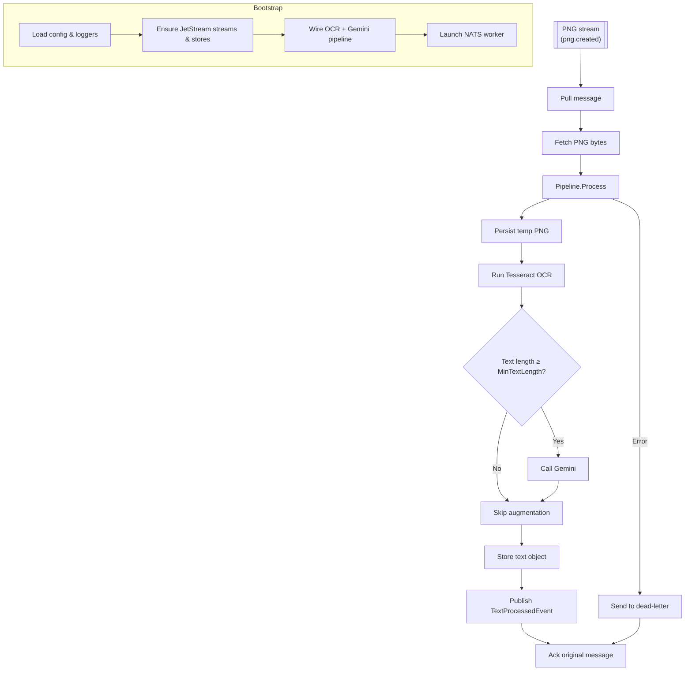

# PNG-to-Text Service

## Project Summary

A NATS-based microservice that performs OCR on PNG images to extract text and optionally augments it with AI-generated commentary.

## Detailed Description

This service listens for `PNGCreatedEvent` messages on a NATS stream. When a message is received, it downloads the PNG file from a NATS object store, performs OCR to extract the text, and then publishes a `TextProcessedEvent` to a NATS stream.

An optional augmentation step can be enabled, where the extracted text and the source image are sent to a multimodal AI model (e.g., Google Gemini) to generate additional context, such as a summary or commentary.

Core capabilities include:

-   **NATS Integration**: Seamlessly integrates with NATS for messaging and object storage.
-   **OCR Processing**: Extracts text from PNG images using Tesseract OCR and cleans the output.
-   **AI Augmentation**: Optionally augments the extracted text with AI-generated content using Gemini models.
-   **Persistent Output**: Stores the processed text in a NATS object store before emitting downstream events.
-   **Robust Error Handling**: Implements explicit NATS message acknowledgment (Ack) for successful processing. For pipeline errors, the original message is published to a dead-letter subject and then acknowledged, preventing reprocessing loops.

## Architecture



Key implementation touchpoints:

- `cmd/png-to-text-service/main.go:41-426` bootstraps logging, configuration, JetStream resources, and launches the worker.
- `internal/worker/worker.go:109-348` pulls `PNGCreatedEvent` messages, drives the pipeline, and handles acknowledgements or dead-letter routing.
- `internal/pipeline/pipeline.go:74-160` writes the PNG to a temporary file, invokes OCR, and conditionally augments the text.
- `internal/ocr/tesseract.go:93-196` validates the PNG input and executes Tesseract plus post-processing cleanup.
- `internal/augment/gemini.go:139-205` builds prompts and interacts with Gemini to enrich the OCR output when enabled.

## Technology Stack

-   **Programming Language:** Go 1.25
-   **Messaging:** NATS
-   **OCR Engine:** Tesseract
-   **AI Integration:** Google Gemini
-   **Libraries:**
    -   `github.com/nats-io/nats.go`
    -   `github.com/book-expert/configurator`
    -   `github.com/book-expert/events`
    -   `github.com/book-expert/logger`
    -   `github.com/book-expert/prompt-builder`
    -   `github.com/google/uuid`
    -   `github.com/stretchr/testify`

## Getting Started

### Prerequisites

-   Go 1.25 or later.
-   NATS server with JetStream enabled.
-   Tesseract OCR (`tesseract`) installed and available in the system's `PATH`.
-   An API key for the AI provider (e.g., Google Gemini), set as an environment variable.

### Installation

To build the service, you can use the `make build` command:

```bash
make build
```

This will create the `png-to-text-service` binary in the `bin` directory.

### Configuration

The service requires a TOML configuration file to be accessible via a URL specified by the `PROJECT_TOML` environment variable. The configuration file should have the following structure:

```toml
[nats]
url = "nats://localhost:4222"
png_stream_name = "pngs"
png_consumer_name = "png_processor"
png_created_subject = "png.created"
png_object_store_bucket = "png_images"
text_stream_name = "texts"
text_processed_subject = "text.processed"
text_object_store_bucket = "text_files"
dead_letter_subject = "dead.letters"

[paths]
base_logs_dir = "/var/log/png-to-text-service"

[png_to_text_service]

[png_to_text_service.tesseract]
language = "eng"
oem = 3
psm = 3
dpi = 300
timeout_seconds = 60

[png_to_text_service.gemini]
api_key_variable = "GEMINI_API_KEY"
models = ["gemini-pro-vision"]
temperature = 0.7
timeout_seconds = 120
max_retries = 3
retry_delay_seconds = 5
top_k = 40
top_p = 0.95
max_tokens = 2048

[png_to_text_service.augmentation]
use_prompt_builder = true
type = "summary"
custom_prompt = ""

[png_to_text_service.augmentation.parameters]
param1 = "value1"
param2 = "value2"

[png_to_text_service.prompts]
augmentation = "Summarize the following text: {{.Text}}"

[png_to_text_service.tts_defaults]
voice = "alloy"
seed = 123
ngl = 4
top_p = 0.95
repetition_penalty = 1.05
temperature = 0.7
```

## Usage

To run the service, execute the binary:

```bash
./bin/png-to-text-service
```

The service will connect to NATS and start listening for messages.

A successful run for each message will:

- download the PNG bytes from the configured `png_object_store_bucket`
- write the final text artifact to the `text_object_store_bucket`
- publish a `TextProcessedEvent` containing the text object key and default TTS parameters
- acknowledge the original message (or forward to the dead-letter subject if processing fails)

## Testing

To run the tests for this service, you can use the `make test` command:

```bash
make test
```

## License

Distributed under the MIT License. See the `LICENSE` file for more information.
